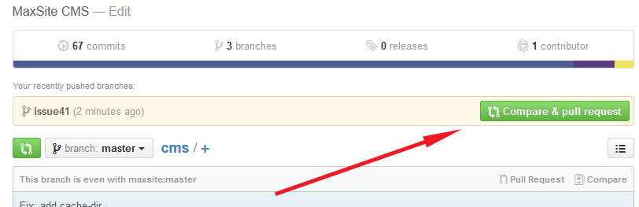

# Для желающих поучаствовать в разработке Maxsite CMS
С помощью данного пошагового руководства можно ~~построить коммунизм за три года~~ внести посильную помощь в разработку Maxsite CMS.

#### Несколько слов
Подразумевается, что вы зарегистрированы на Гитхаб, на компьютере уже установлен Гит и вы знакомы с данной [СКВ](https://ru.wikipedia.org/wiki/Система_управления_версиями).

**Общие наименования**

- **главный (основной) репозиторий** - здесь и далее будет подразумеваться [канонический репозиторий](https://github.com/maxsite/cms) автора Maxsite CMS. В командном режиме имеет псевдоним `upstream`.
- **форк** - копия главного репозитория в вашем аккаунте на Гитхаб. В командном режиме имеет псевдоним `origin`.
- **локальный репозиторий** - форк, скопированный на ваш компьютер.

*Главный репозиторий* и *форк* являются удаленными репозиториями, т. е. расположенными на сервере Гитхаб. Ветки на удаленных репозиториях обозначаются в формате *псевдоним/ветка*, например, **origin/dev** или **upstream/master**


## Подготовка
### Сделайте форк
Итак, перейдите в главный репозиторий [Maxsite CMS](https://github.com/maxsite/cms) и нажмите кнопку "Fork":


Спустя несколько мгновений Гитхаб скопирует основной репозиторий в ваш аккаунт, о чем укажет подсказка рядом с названием репозитория:


### Перенесите форк на компьютер
Поскольку вся разработка происходит локально, а Гитхаб нужен для синхронизации разработки между участниками проекта, необходимо скопировать форк на свой компьютер.
Для этого наберите в командной строке следующую команду, заменив USERNAME на ваше имя пользователя в Гитхаб:

`$ git clone https://github.com/USERNAME/cms`

Гит произведет некоторую работу и создаст копию форка на компьютере. Именно с этим локальным репозиторием вам и предстоит работать в дальнейшем.

При клонировании на компьютере будет создана только одна ветвь - **master**, которая будет связанна с веткой **origin/master** на сервере. Добавить ветку **dev** придется вручную:

`$ git checkout --track origin/dev`

Эта команда создаст локальную ветку **dev** и свяжет ее с веткой **origin/dev** на сервере. Проверяем  для надежности "связанность" веток командой `git branch -vv`. Должно напечататься что-то вроде такого (* указывает, на какой ветке вы сейчас находитесь):
```
* dev 89b478 [origin/dev] Пояснения к коммиту
  master 756c9e0 [origin/master] Пояснения к коммиту
```

### Установите связь с главным репозиторием
В процессе разработки главный репозиторий неизбежно будет изменяться, поскольку CMS развивается: периодически вносятся улучшения и исправляются баги, обновляются различные компоненты. Для того, чтобы локальный репозиторий (и форк) всегда был в актуальном состоянии, требуется указать ссылку, по которой вы можете получать обновления из главного репозитория. Наберите

`$ git remote add upstream https://github.com/maxsite/cms.git`

Убедитесь, что связь установлена, набрав `$ git remote -v`. В консоли должен вывестись следующий текст
```
origin    https://github.com/USERNAME/cms.git (fetch)
origin    https://github.com/USERNAME/cms.git (push)
upstream  https://github.com/maxsite/cms.git (fetch)
upstream  https://github.com/maxsite/cms.git (push)
```
Гит показывает, что в оба удаленных репозитория (главный - **upstream** и ваш форк - **origin**) можно вносить изменения (push), но на практике вы будете только забирать обновления из главного репозитория.

### Получите обновления из главного репозитория
Настало время забрать последние изменения из главного репозитория в локальный. Наберите в командной строке

`$ git fetch upstream`

Если в главном репозитории произошли какие-то изменения, Гит выведет соответсвующее уведомление:

```
remote: Counting objects: 6, done.
remote: Compressing objects: 100% (6/6), done.
remote: Total 6 (delta 0), reused 0 (delta 0), pack-reused 0
Unpacking objects: 100% (6/6), done.
From https://github.com/maxsite/cms
   620e596..9602bd8  dev        -> upstream/dev
```
Последняя строка говорит о том, что ветка **dev** в главном репозитории изменилась. Следует влить эти изменения в локальный репозиторий. Гит показывает, какая ветка является текущей в данный момент; и если вы находитесь на другой ветке, переключитесь на ветку **dev** набрав

`git checkout dev`

а затем напечатайте

`git merge upstream/dev`

Теперь все изменения, произошедшие в ветке **dev** главного репозитория отражены на вашем компьютере, т. e. ваша локальная ветка **dev** находится в том же состоянии, что и ветка **upstream/dev**.

В завершение остается обновить форк командой

`git push origin dev`

---
**Обратите внимание!**

_Выше рассмотрен случай, когда изменения коснулись только ветки **dev**. Если в главном репозитории одновременно с **dev** изменилась бы и ветка **master**, то указанные шаги надо повторить для этой ветки:_ 

`git checkout master`


`git merge upstream/master`


`git push origin master`

---

## Процесс
### Реализуйте улучшение
Прежде чем вносить свои изменения в код CMS, рекомендуется создать [issue в главном репозитории](https://github.com/maxsite/cms/issues). Это позволить обсудить ваше предложение с автором и другими участниками сообщества.

После обсуждения можно брать быка за рога.

Находясь на ветке **dev** создайте новую ветку, в которой вы будете действовать (исправлять баг или вносить улучшение):

`$ git checkout -b issue41`

Теперь вы окажитесь на ветке **issue41**, которая является ответвлением ветки **dev**. Можно вносить правки в код, делать коммиты.

---

**Обратите внимание!**

_Ветки, подобные **issue41** являются короткоживущими (их еще называют тематическими), т. е. создаются, чтобы решить конкретную поставленную задачу. Работая в такой ветке **НЕ вносите изменений , которые не относятся к решению вашей проблемы**. Здесь работает простое правило **"Одна задача - одна ветка"**._

_К примеру, если во время работы пришла мысль исправить какой-то баг, не относящийся к текущей задаче, для него надо завести новую ветку на основе ветки **dev**._

---

После того как работа закончена, следует синхронизироваться с главным репозиторием. Если этого не сделать, может случиться так, что ветка **dev** главного репозитория обновилась, и у автора Maxsite CMS не будет технической возможности принять ваш пулл-реквест. Чтобы не запутаться, последовательность шагов должна быть такой:

`$ git fetch upstream`

Если никаких изменений в ветке **dev** главного репозитория не произошло, можно смело заливать свою тематическую ветвь **issue41** в форк (об этом чуть ниже).

Если ветка **dev** изменилась, сначала надо проделать шаги, описанные в подразделе "Получите обновления из главного репозитория", т. е.

`git checkout dev`

`git merge upstream/dev`

`git push origin dev`

Далее необходимо влить новые изменения ветки **dev** в вашу тематическую ветку:

`git checkout issue41`

`git merge dev`

Таким образом, ветка **issue41** будет содержать все обновления, произошедшие в ветке **dev** главного репозитория + хранить реализацию по улучшению CMS, сделанную вами ранее.

---

**Обратите внимание!**

_В процессе вливания ветки **dev** в тематическую ветку могут возникать конфликты. Разрешение конфликтов при слиянии выходит за рамки данного руководства, вам следует разобраться с этим вопросом самостоятельно._

---

Остается только залить тематическую ветку в свой форк:

`git push origin issue41`

### Отправьте пулл-реквест

Перейдите в свой форк на Гитхабе и нажмите кнопку, создающую пулл-реквест:



На странице создания пулл-реквеста выберите правильное направление. В качестве цели любого пулл-реквеста **всегда должна быть выбрана ветка *dev* главного репозитория Maxsite CMS**:


Заключительный шаг - укажите краткое название вашего пулл-реквеста:


## Полезное
### Теги

Новые версии Maxsite CMS маркируются автором с помощью [тегов](https://github.com/maxsite/cms/releases). Команда `$ git fetch upstream` не только получает обновления веток из главного репозитория, но и показывает, какие теги появились.

Для обновления тегов в своем форке достаточно набрать

`$ git push origin --tags`

### Ресурсы для изучения
Если вы новичок в Гит, но хотите помочь в разработке CMS, имеет смысл ознакомится со следующими источниками, которые помогут разобраться в Гит и понять, как работает эта система контроля версий:
- Pro Git Book: [v1 издание 2009 г.](http://git-scm.com/book/ru/v1)  и [v2 издание 2014 г.](http://git-scm.com/book/ru/v2) 
- [TryGit](http://try.github.com/levels/1/challenges/1)
- [Простое руководство по работе с git](http://rogerdudler.github.io/git-guide/index.ru.html)
- [GitHub for Cats!](http://ericsteinborn.com/github-for-cats/)

### Софт
Cуществует ряд программ (GUI), позволяющих работать с Гит в графическом режиме. Возможно, они смогут избавить вас от страданий при работе в консоли :smile: Выделим троих:

- [GitHub for Windows](https://windows.github.com/)
- [SourceTree](http://www.sourcetreeapp.com/)
- [SmartGit](http://www.syntevo.com/smartgit/)

Первая попроще, предназначена для работы только с Гитхаб; две другие являются многофункцональными и предоставляют больше возможностей и инструментов.
